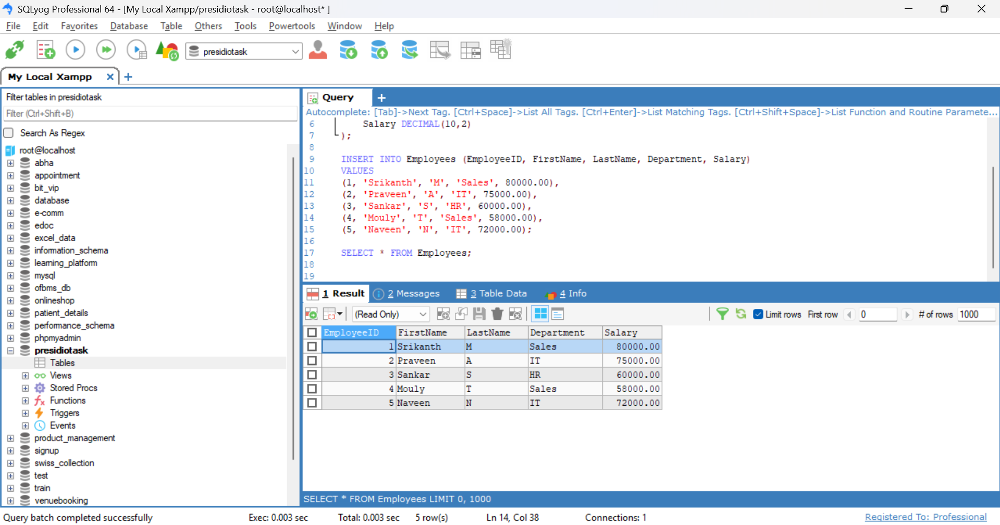

## Task

## **Creating and Populating Tables**
    
#### **Objective:**
    
- Set up a simple table, insert data, and retrieve that data using basic queries.
    
#### **Requirements:**
    
- Use `CREATE TABLE` to define a table (e.g., `Employees` or `Products`) with appropriate data types and constraints.
- Populate the table using `INSERT INTO` with multiple rows of sample data.
- Execute a basic `SELECT * FROM TableName;` query to verify the data insertion.


### **Step 1:**  
I ran the following SQL command to create a new database:  
```sql
CREATE DATABASE presidiotask;
```


### **Step 2:**  
I defined the `Employees` table with appropriate columns and data types:  
```sql
CREATE TABLE Employees (
    EmployeeID INT PRIMARY KEY,
    FirstName VARCHAR(50),
    LastName VARCHAR(50),
    Department VARCHAR(50),
    Salary DECIMAL(10,2)
);
```

### **Step 3:**  
I inserted multiple rows into the `Employees` table:  
```sql
INSERT INTO Employees (EmployeeID, FirstName, LastName, Department, Salary)
VALUES
(1, 'Srikanth', 'M', 'Sales', 80000.00),
(2, 'Praveen', 'A', 'IT', 75000.00),
(3, 'Sankar', 'S', 'HR', 60000.00),
(4, 'Mouly', 'T', 'Sales', 58000.00),
(5, 'Naveen', 'N', 'IT', 72000.00);
```

### Step 4: 
I executed a `SELECT` query to check if the data was inserted successfully:  
```sql
SELECT * FROM Employees;
```

### Output Screenshot:


