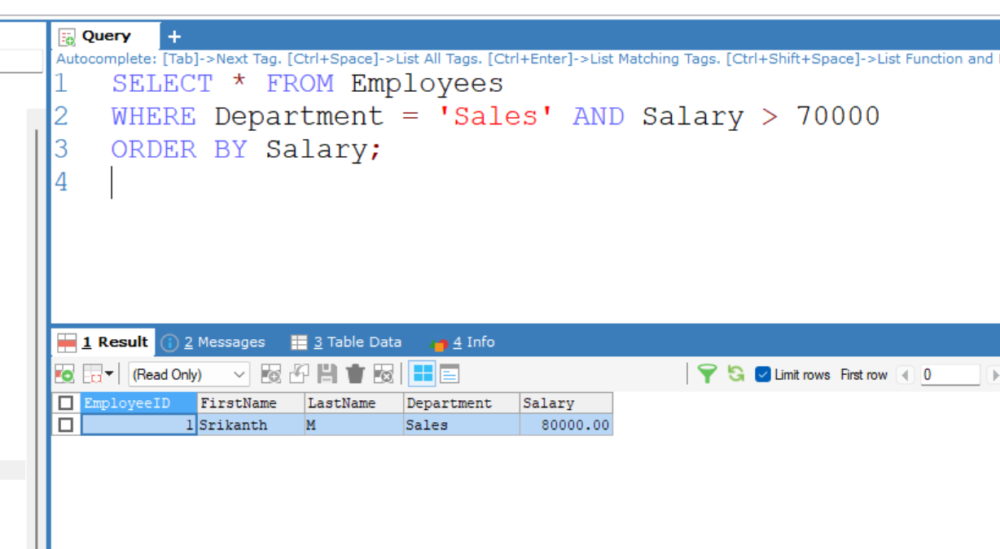

## Task 2

## **Basic Filtering and Sorting**
    
### **Objective:**
    
- Write queries that filter records and sort the result set.

### **Requirements:**

- Use the `WHERE` clause to filter records based on a condition (e.g., `WHERE Department = 'Sales'`).
- Apply the `ORDER BY` clause to sort the results (e.g., by `LastName` or `Salary`).
- Experiment with multiple conditions using `AND`/`OR`.

## Execution 

### **Step 1: Filtered Records Based on Conditions**  
I used the `WHERE` clause to retrieve employees who work in the Sales department and have a salary greater than 70,000.  

### **Step 2: Sorted the Results**  
I applied the `ORDER BY` clause to sort the filtered records by salary in ascending order.  

```sql
SELECT * FROM Employees 
WHERE Department = 'Sales' AND Salary > 70000
ORDER BY Salary;
```

## **Input Data (Employees Table)**  


## **Query Output**  


