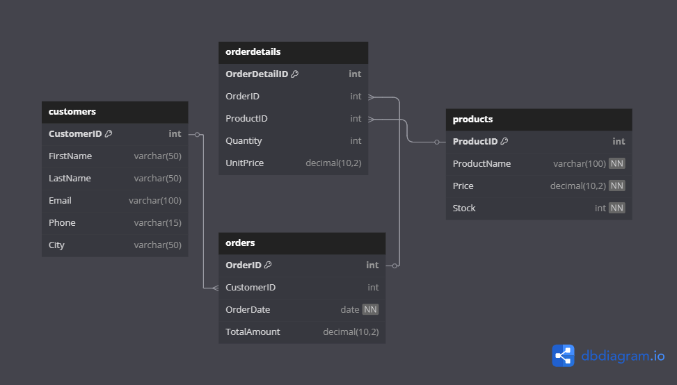

# Task 10: Comprehensive Database Design, Optimization, and Advanced SQL Features

## Task Objective

The purpose of this task was to build a robust and normalized relational database schema for an **eCommerce platform**, enriched with advanced SQL functionalities to handle **data integrity**, **automation**, and **performance optimization**.


##  Database Schema Design

Four major tables were created:

```sql
CREATE TABLE `customers` (
  `CustomerID` INT NOT NULL AUTO_INCREMENT,
  `FirstName` VARCHAR(50),
  `LastName` VARCHAR(50),
  `Email` VARCHAR(100),
  `Phone` VARCHAR(15),
  `City` VARCHAR(50),
  PRIMARY KEY (`CustomerID`),
  UNIQUE KEY `Email` (`Email`)
);

CREATE TABLE `products` (
  `ProductID` INT NOT NULL AUTO_INCREMENT,
  `ProductName` VARCHAR(100) NOT NULL,
  `Price` DECIMAL(10,2) NOT NULL,
  `Stock` INT NOT NULL,
  PRIMARY KEY (`ProductID`),
  UNIQUE KEY `ProductName` (`ProductName`)
);

CREATE TABLE `orders` (
  `OrderID` INT NOT NULL AUTO_INCREMENT,
  `CustomerID` INT,
  `OrderDate` DATE NOT NULL,
  `TotalAmount` DECIMAL(10,2),
  PRIMARY KEY (`OrderID`),
  FOREIGN KEY (`CustomerID`) REFERENCES `customers`(`CustomerID`)
);

CREATE TABLE `orderdetails` (
  `OrderDetailID` INT NOT NULL AUTO_INCREMENT,
  `OrderID` INT,
  `ProductID` INT,
  `Quantity` INT,
  `UnitPrice` DECIMAL(10,2),
  PRIMARY KEY (`OrderDetailID`),
  FOREIGN KEY (`OrderID`) REFERENCES `orders`(`OrderID`),
  FOREIGN KEY (`ProductID`) REFERENCES `products`(`ProductID`)
);
```

### Schema Diagram


---

## Execution Process

### Functions

#### 1. Get Product ID by Name
``` sql
CREATE FUNCTION getProductID(p_ProductName VARCHAR(100)) RETURNS INT
BEGIN
  DECLARE v_id INT;
  SELECT ProductID INTO v_id FROM products WHERE ProductName = p_ProductName LIMIT 1;
  RETURN v_id;
END;
```

#### 2. Calculate Total Amount
``` sql
CREATE FUNCTION getTotalAmount(p_ProductName VARCHAR(100), p_Quantity INT) RETURNS INT
BEGIN
  DECLARE v_Amount INT;
  SELECT Price INTO v_Amount FROM products WHERE ProductID = getProductID(p_ProductName);
  SET v_Amount = v_Amount * p_Quantity;
  RETURN v_Amount;
END;
```

#### 3. Check Available Stock
``` sql
CREATE FUNCTION checkStock(p_ProductName VARCHAR(100), p_Quantity INT) RETURNS INT
BEGIN
  DECLARE v_checker INT;
  SELECT COUNT(1) INTO v_checker FROM products
  WHERE ProductID = getProductID(p_ProductName) AND Stock >= p_Quantity;
  RETURN IF(v_checker > 0, 1, 0);
END;
```

### Stored Procedure: `placeOrder`

```sql
CREATE PROCEDURE placeOrder(p_CustomerID INT, p_ProductName VARCHAR(100), p_Quantity INT)
BEGIN
  DECLARE v_checkQuantity INT;
  DECLARE latestID INT;

  DECLARE EXIT HANDLER FOR SQLEXCEPTION
  BEGIN 
    ROLLBACK;
    SELECT 'Error occurred. Transaction rolled back.' AS Message;
  END; 

  START TRANSACTION;

  SET v_checkQuantity = checkStock(p_ProductName, p_Quantity);

  IF v_checkQuantity = 1 THEN 
    INSERT INTO orders (CustomerID, OrderDate, TotalAmount)
    VALUES (p_CustomerID, CURDATE(), getTotalAmount(p_ProductName, p_Quantity));

    SET latestID = LAST_INSERT_ID();

    INSERT INTO orderdetails (OrderID, ProductID, Quantity, UnitPrice)
    VALUES (latestID, getProductID(p_ProductName), p_Quantity, getTotalAmount(p_ProductName, 1));

    COMMIT;
    SELECT 'Order placed successfully' AS Message;
  ELSE
    ROLLBACK;
    SELECT 'Insufficient product quantity' AS Message;
  END IF;
END;
```

---

### Trigger: Automatically Update Stock

```sql
CREATE TRIGGER updateStock
AFTER INSERT ON orderdetails
FOR EACH ROW
BEGIN
  UPDATE products
  SET Stock = Stock - NEW.Quantity
  WHERE ProductID = NEW.ProductID AND Stock >= NEW.Quantity;
END;
```

---

### Reporting Procedures

```sql
-- Get Customer Order Summary
CREATE PROCEDURE CustomerOrders(p_CustomerID INT)
BEGIN
  SELECT 
    CONCAT(c.FirstName, ' ', c.LastName) AS FullName, c.Email, c.Phone, c.City,
    o.OrderDate, p.ProductName, od.Quantity, o.TotalAmount
  FROM customers c
  JOIN orders o ON o.CustomerID = c.CustomerID
  JOIN orderdetails od ON od.OrderID = o.OrderID
  JOIN products p ON p.ProductID = od.ProductID
  WHERE c.CustomerID = p_CustomerID;
END;

-- Get Total Order Amount for a Customer
CREATE FUNCTION TotalOrderAmountByCustomer(p_CustomerID INT)
RETURNS DECIMAL(10,2)
BEGIN
  DECLARE v_amount DECIMAL(10,2);
  SELECT SUM(o.TotalAmount)
  INTO v_amount
  FROM orders o
  WHERE o.CustomerID = p_CustomerID;
  RETURN v_amount;
END;
```

---

### Indexes for Performance

```sql
CREATE INDEX idx_product_name ON products(ProductName);
CREATE INDEX idx_product_id ON products(ProductID);
CREATE INDEX idx_orderdetails_product ON orderdetails(ProductID);
CREATE INDEX idx_orders_customer ON orders(CustomerID);
```

---

##  Testing and Output

### 1. Placing an Order
```sql
CALL placeOrder(4, "Drawing Tablet", 2);
```
**Output:**

| Message                   |
|---------------------------|
| Order placed successfully |

---

### 2. Viewing Customer Orders
```sql
CALL CustomerOrders(4);
```

**Output:**

| FullName    | Email            | Phone       | City     | OrderDate  | ProductName       | Quantity | TotalAmount |
|-------------|------------------|-------------|----------|------------|-------------------|----------|-------------|
| Sara Davis  | sara@example.com | 4567890123  | Houston  | 2024-04-04 | External HDD 1TB  | 2        | 150.75      |
| Sara Davis  | sara@example.com | 4567890123  | Houston  | 2025-04-17 | Drawing Tablet    | 2        | 260.00      |

---

### 3. Customer Total Spend
```sql
SELECT TotalOrderAmountByCustomer(4);
```

**Output:**

| TotalOrderAmountByCustomer(4)|
|---------------------------|
| 410.75 |


---

### 4. Attempt to Order More Than Available Stock
```sql
CALL placeOrder(4, "Drawing Tablet", 20);
```
**Output:**
| Message                   |
|---------------------------|
| Insufficient product quantity |

---

### Concepts used:

- User Defined Functions
- Stored Procedures
- Indexing 
- Triggers
- Transactions
